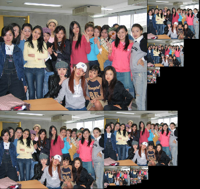

Only support my caffe branch: https://github.com/happynear/caffe-windows/tree/ms . It contains a GPU bounding box regression layer,
a specified data transformer and a DLL with no Caffe headers(for fast compiling in other programs). 

It is approximately 2~3 faster than the original Matlab version. I am still attempting to refactor the first network by multi-thread inference. It's really a difficult work. If you have any suggestions, please contact me via the Issue in my caffe-windows
repository https://github.com/happynear/caffe-windows/issues/168 .

Update:

I used a method proposed in DenseNet(https://arxiv.org/abs/1404.1869) to accelerate the PNet(12-net). The main idea is to stitching images with all scales into one big image and apply the PNet on it within one forward inference. In this way, all scales are processed parallelly and there is no need to malloc and free memory again and again in each scale, which is somewhat time consuming. The effect of image stitching is as follow:

As you can see, there is some black regions in the stitched image. So it is not a good idea to directly stitching all scales of images because bigger scale means larger black regions. In my code, I only stitch images within 20000 pixels and leave bigger scales proccessed as usual (i.e. process them separately). In another word, this trick only optimize the spire(top) of the image pyramid. Since no matter how big the image is, its image pyramid all have the spire part, this trick can always save 5-10ms for every image on my GPU(GTX 1080). You may test and modify the parameter (20000 pixels) to get the maximal speed on your GPU card.
